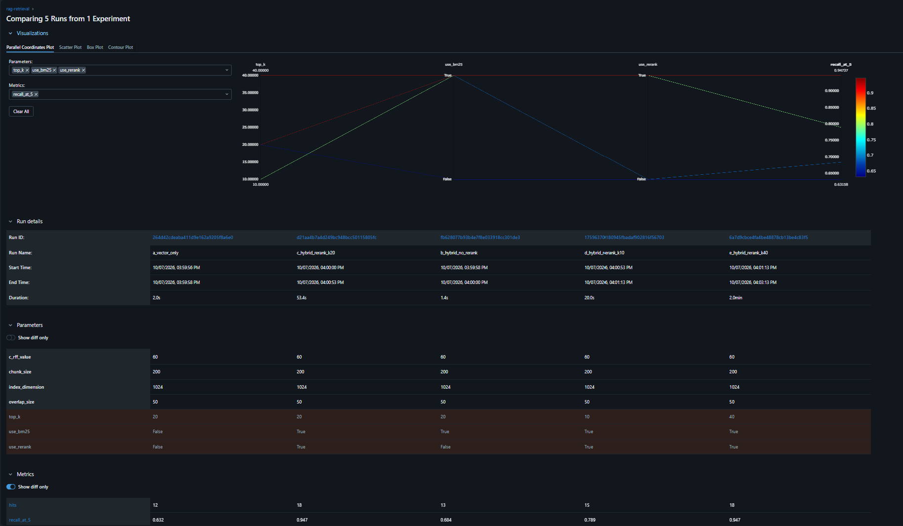

# RAG v3 — Measured, Eval-Driven Document Q&A

A Retrieval-Augmented Generation (RAG) service built with an eval-first discipline: every
retrieval change is judged by a number on a hand-written eval set, never on vibes. It runs as
a FastAPI service in Docker, stores documents in Postgres + pgvector, and tracks every
retrieval experiment in MLflow. This README also records what didn't work and what is still open.

## Architecture

```
upload:  file -> load_document -> chunk (200 tokens, 50 overlap) -> embed (bge-large, 1024-d)
              -> Postgres (chunks + pgvector), per user_id, duplicate uploads skipped (SHA-256)
ask:     question -> embed -> BM25 over the user's chunks + pgvector search
              -> RRF fusion -> cross-encoder rerank -> top 5 chunks -> LLM answer
eval:    retrieval recall@5 through the same Postgres code path; every config logged to MLflow
```

- `src/api.py` — FastAPI app: `POST /upload` (file + `user_id`) and `POST /ask` (`question`, `user_id`).
- `src/db.py` — Postgres access: connection pool, chunk storage, per-user pgvector search.
- `src/pipelines.py` — orchestration: upload processing, `ask_question_phase1` (retrieval, with
  `use_bm25` / `use_rerank` / `top_k` switches) and `ask_question_phase2` (LLM), the eval loop.
- `src/embedder.py` — dense embeddings (`BAAI/bge-large-en-v1.5`), BM25, Reciprocal Rank
  Fusion, cross-encoder reranker (`BAAI/bge-reranker-base`).
- `src/model.py` — LLM layer: `LLM_BACKEND` = `ollama` | `claude` | `gemini`, with retry and
  fallback across models.
- `src/track_eval.py` — runs the retrieval grid and logs each config as an MLflow run.
- `src/timing.py` — per-stage timings written to the container log (logger `rag.timing`).
- `Dockerfile` + `docker-compose.yml` — `api` (port 8003) and `db` (`pgvector/pgvector:pg16`)
  with persistent volumes for Postgres data and the HuggingFace model cache.

## Status

| Step | Status |
|---|---|
| FastAPI `/upload` + `/ask` | Done |
| Docker + compose, volumes, persistence verified | Done |
| Postgres + pgvector replaces FAISS + JSON files (pool, duplicate skip, per-user isolation) | Done |
| Provider-agnostic LLM switch with retry/fallback | Done |
| Stage timings in the container log | Done |
| Retrieval eval through Postgres + MLflow experiment tracking | Done |
| GPU passthrough for the embedder/reranker | Not done |
| Cloud deployment (Azure/AWS) | Not started |
| Auth, CI-gated eval, frontend | Not started |

## Results

### Retrieval quality (MLflow, Postgres + pgvector, 19 answerable questions)

Eval set: `src/test_sets/eval_set_one.json`, hand-written from a nursing-home fall-risk
research paper. 22 questions, 3 are unanswerable and skipped, leaving 19. recall@5 counts a
question as a hit when every required gold snippet appears in the top-5 retrieved chunks.
Each config is one run in the `rag-retrieval` experiment (`src/track_eval.py`).

| Config | recall@5 | Hits |
|---|---|---|
| a) vector only, top_k 20 | 63.2% | 12/19 |
| b) vector + BM25 (RRF), no rerank, top_k 20 | 68.4% | 13/19 |
| c) vector + BM25 + rerank, top_k 20 (**current**) | **94.7%** | 18/19 |
| d) vector + BM25 + rerank, top_k 10 | 78.9% | 15/19 |
| e) vector + BM25 + rerank, top_k 40 | 94.7% | 18/19 |



- Reranking is the big lever: +5 questions over b.
- BM25 over vector-only is +1 question, within noise on this set.
- Widening the candidate pool from 20 to 40 adds nothing; shrinking it to 10 costs 3 questions.
- Re-running the whole grid gave identical numbers, so retrieval is deterministic.
- Caveats: 19 questions (1 question ~ 5 points), one document, one run per config. Claim
  "about 90-95% recall@5 on a 19-question hand-written set", not a precise figure.
- The single miss in config c: "Why does the review argue that current fall risk assessment
  tools are insufficient, and what direction does it recommend for future development?"
  (a multi-chunk "why / what direction" question). Not yet investigated.

*Earlier baseline (in-memory FAISS, 22 questions including the 3 unanswerable ones): hit@5 =
90.9% (20/22). Different denominator, so it is not a like-for-like comparison.*

### Latency per `/ask` query

Measured 2026-10-06, Docker Compose stack on a Windows 11 host, CPU-only embedder and
reranker, one run each (not averaged).

| Stage | Local qwen3.5:9b (Ollama) | Hosted Gemini flash |
|---|---|---|
| rerank (CPU cross-encoder) | 1.2 s | 1.7 s |
| vector search (pgvector) | ~0 s | 0.007 s |
| LLM call | 57.7 s | 5.5 s |
| total | ~59 s | 7.8 s |

The LLM call dominates end-to-end latency; retrieval is cheap. Uploading an 87-chunk document
takes ~63 s on CPU (embedding), which GPU passthrough would reduce. Hosted Gemini sends
retrieved chunks to Google; Ollama remains the private/local option.

### Generation quality (SQuAD v2, 100 Q, earlier pipeline)

| Backend | Faithfulness | Accuracy | Hallucinated-on-impossible | False-refusal-on-answerable |
|---|---|---|---|---|
| qwen3-coder-30b | 88% | ~67% | 23/55 (42%, ~7% once judge/label noise is separated out) | 6/45 (13%) |
| Claude Sonnet 5 | 96% | 76% | 11/55 (20%, ~7% real fabrication after the same correction) | 9/45 (20%) |

Measured before the move to Postgres and not re-run since. SQuAD was used to debug the
harness, not to tune retrieval.

## Key findings

- **A metric bug can look exactly like a real result.** A whitespace mismatch between
  PDF-extracted text and hand-typed snippets gave a 0% hit rate, then a strict substring
  match still under-counted (hyphenation, curly quotes). The fix was a normalized comparison
  (`snippets_hit`: lowercase letters and digits only, both sides). Same retrieval, hit@5 rose
  from ~27-36% to 81.8% at the time.
- **An unbounded candidate list is not "hit@5".** With the reranker off, an early eval passed
  the whole fused list to the hit check and reported 100%. Truncated to 5, it was 72.7%.
- **"Hallucination on impossible questions" needed splitting by faithfulness.** Most such
  answers were grounded in the context and only disagreed with an overly strict label; the
  naive metric overstated hallucination ~3x.
- **Moving state into Postgres broke the eval harness** (it read JSON files from disk). It now
  reads through the psycopg pool and uses the same retrieval code as the API.
- **Relative paths depend on where you launch from.** Run scripts from the repo root; the
  MLflow store (`mlflow.db`) and the eval-set path are resolved relative to the working directory.
- Two earlier conclusions (a "31.6% reranker-on-everything" result and "chunk boundaries
  destroy ~25% of misses") were drawn with the under-counting matcher and are withdrawn.
- Contextual Retrieval (LLM-written per-chunk blurbs) was implemented earlier, but its effect
  on recall was never cleanly measured.

## Limitations

- **Tiny eval set, single document.** 19 answerable questions on one academic paper; results
  may not generalize to other document types.
- **Chunking is naive.** Fixed 200-token windows with 50 overlap, no sentence or paragraph
  awareness. Its measured impact is unknown.
- **PDF extraction artifacts** (line-break hyphenation) hurt BM25 tokenization and are not fixed
  at the loader.
- **CPU-only embedder and reranker** in the container; uploads are slow.
- **Latency numbers are single runs** and the exact Gemini model id was not recorded.
- **BM25 candidate count is fixed** by `hybdrid_embedding_top_k` in `config.py`; the `top_k`
  switch only changes the vector search and the fused list.
- **LLM-judge noise was never quantified**, and generation eval has not been re-run against
  the real document or the Postgres pipeline.
- No auth on the API, no CI gate, no frontend, not yet deployed.

## Setup and running

```bash
pip install -r requirements.txt
docker compose up --build        # api on http://127.0.0.1:8003, Postgres on 5432
```

Needs a `.env` with `POSTGRES_PASSWORD`, `LLM_BACKEND` (`ollama` | `claude` | `gemini`) and the
credentials for the backend you pick. See `src/config.py` for chunking and retrieval parameters.
Use `127.0.0.1`, not `localhost`, on Windows (IPv6 resolution hangs).

Run the retrieval experiments from the repo root, with the eval document uploaded under
`user_id` 99:

```bash
python src/track_eval.py         # logs the a-e grid to MLflow
mlflow ui --port 5000            # run from the same directory; open http://127.0.0.1:5000
```

## Roadmap

1. Inspect the one missed eval question (retrieval problem or multi-chunk question?).
2. Cloud deployment: container registry, container app, managed Postgres, secrets.
3. GPU passthrough for the embedder and reranker.
4. Stretch: MLflow service in docker-compose, compare LLM backends via the generation eval.
